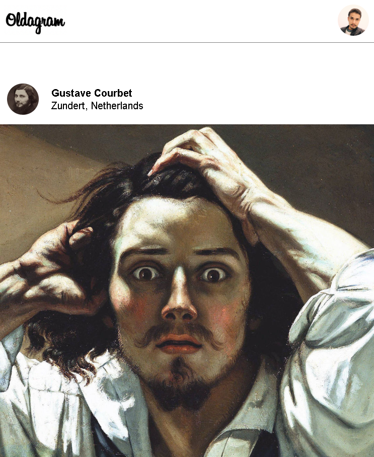
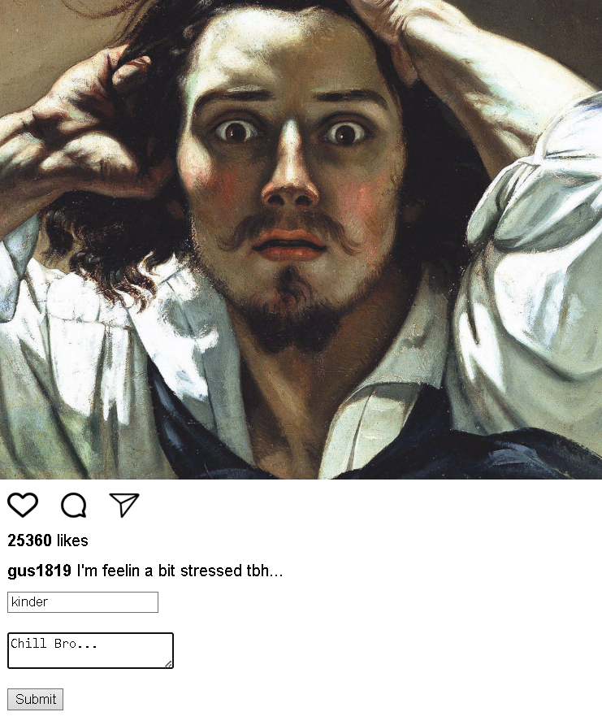

# 📸 Instagram Clone (Oldgram)

A simple Instagram-style web app built using **HTML, CSS, and JavaScript**.
This project focuses on building interactive UI and understanding how JavaScript controls the DOM.

---

## 🚀 Live Demo

👉 [https://oldgram-insta-close-alam.netlify.app](https://oldgram-insta-close-alam.netlify.app)

---

## 🚀 Features

* ❤️ **Like System**

  * Click to increase likes
  * Double-click on image to like
  * Smooth scale animation

* 💬 **Comment System**

  * Dynamic comment form on button click
  * User can add username and comment
  * Comment is rendered instantly

* 🎯 **Interactive UI**

  * Hover and click animations
  * Clean, centered layout
  * Instagram-inspired design

---

## 📸 Screenshots

### 🏠 Home Feed


### ❤️ Like Interaction


### 💬 Comment Feature


### 🎯 UI Layout


---

## 🧠 What I Learned

* **DOM Manipulation**

```javascript id="w1d9ks"
// Selecting elements
const likeNum = document.getElementById("like-num");

// Creating new element
const commentBox = document.createElement("p");

// Injecting content
commentBox.innerHTML = `<strong>${username}</strong>: ${comment}`;

// Updating UI dynamically
likeNum.textContent = preCount + count;

// Adding element to the page
container.appendChild(commentBox);
```

---

## 🛠️ Tech Stack

* HTML5
* CSS3
* JavaScript (Vanilla)

---

## 📚 Learning Source

I am learning Full Stack Web Development from Scrimba:
👉 [https://scrimba.com/?via=u43a7734](https://scrimba.com/?via=u43a7734)

---

## 🔗 Connect With Me

* 💼 LinkedIn: [https://www.linkedin.com/in/fakhar-e-alam-a046133b4/](https://www.linkedin.com/in/fakhar-e-alam-a046133b4/)
* 💻 GitHub: [https://github.com/ThisisAlam](https://github.com/ThisisAlam)

---

## 🎯 Project Goal

* Strengthen JavaScript fundamentals
* Understand how real-world apps handle interaction
* Practice building dynamic UI from scratch

---

## 🔮 Future Improvements

* Store comments using Local Storage
* Add like/unlike toggle
* Improve animations (heart popup ❤️)
* Make it fully responsive

---

## 📝 Final Note

Before writing code on a computer, I first write it on paper.
It helps me visualize logic, understand flow, and build a clear structure before implementation.

---

If you want, I can next help you turn this into a **top-tier portfolio project README with screenshots and badges**—that’s what really catches attention.
